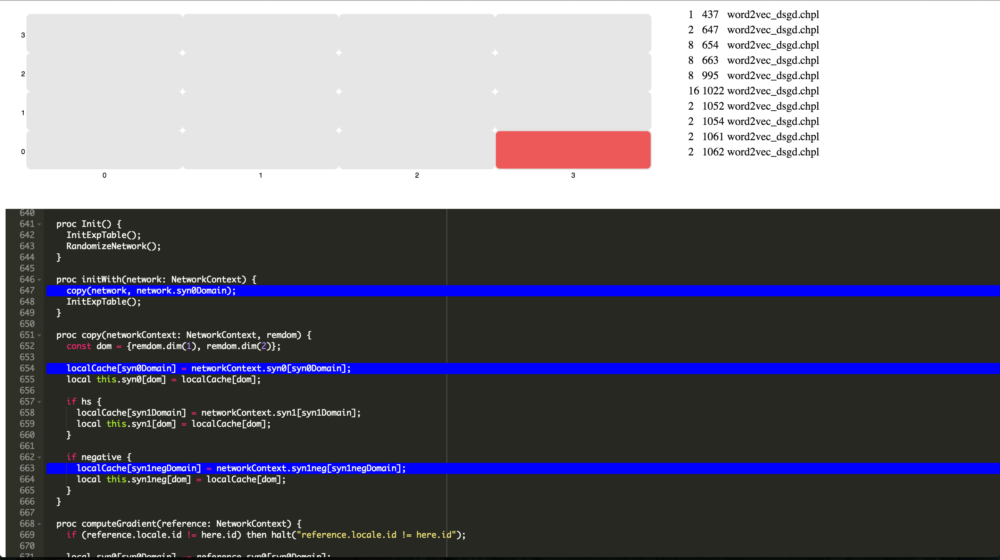

# chrack

## What it does

`chrack` generates a heat map visualization of multi-locale communication
in Chapel.

## How to install

    npm install

## How to run it

    npm start <path-to-chplvis-log-directory>

Then open a browser to localhost:8080
